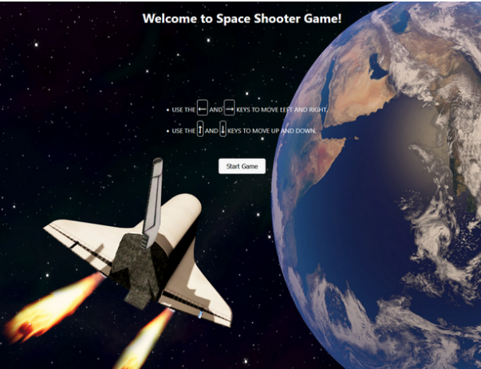
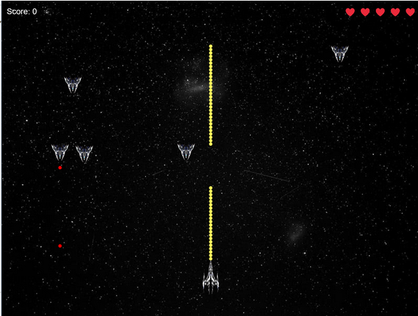
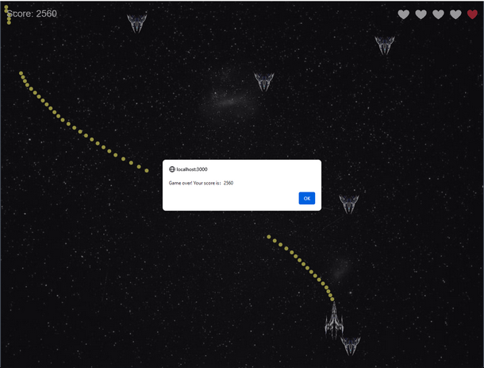

# CPA

## Pour lancer le projet

### Prérequis

- nodejs

### Installation

```bash
npm install
```

ou avec yarn

```bash
yarn install
```

### Lancer le projet

```bash
npm run start
```

ou avec yarn

```bash
yarn start
```

### Changer le cache de yarn (pour ne pas dépasser le quota de la ppit)

```bash
mkdir /Vrac/cache-yarn
yarn config set cache-folder /Vrac/cache-yarn
```

## S7

Fourni : 2 balles rouges sans la bleu

A faire :

- ajouter des balles
- changer la couleur des balles
- zoom translation

  - zoom sur 0 0
  - zoom sur x y
  - bonus translation

## S8

Fourni : correction S7

A faire :

- ajouter la balle bleu
- collision avec les rouges
- balle bleu golf

## S9

Fourni : correction S8

A faire :

- force gravitationnel
- random work
- magnetic
- frottements

## Projet

L’objectif du projet est de développer un jeu en 2D de type Space Shooter en utilisant React. Dans ce jeu, les joueurs prendront le contrôle d’un vaisseau spatial et affronteront des vagues d’ennemis dans l’espace.
Objectif créer un petit jeu en 2D (ou 3D isométrique) jouable en navigateur.

Contraintes :
Avoir au moins un de ces éléments présent dans le jeu :

- de la physique (collision, gravité)
- de la génération aléatoire (création de niveau aléatoire: labyrinthe, plateforme, ennemi)
- du pathfinding (des éléments de jeu utilisant un algo de pathfinding: Dijkstra, A*, D*)


### Exemples/Idées
- jeu de plateforme: gravité, collision, niveaux aléatoires
- aventure (zelda like): collision, pathfinding, niveaux aléatoire
- rogue like: collision, pathfinding, niveaux aléatoire
- shoot them up: gravité, collision, ennemis aléatoire
- jeu de billard: collision
- pacman: pathfinding


#### Image



